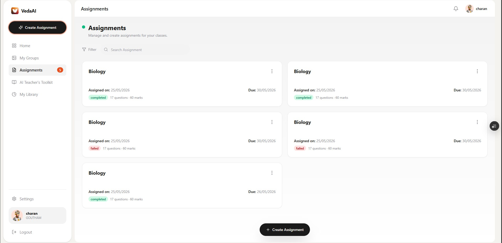
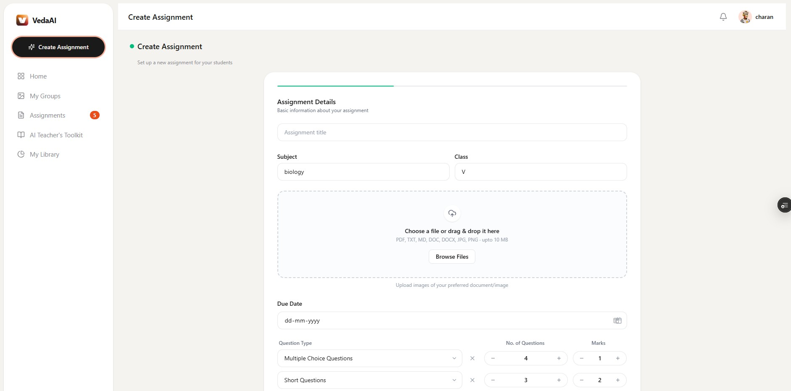
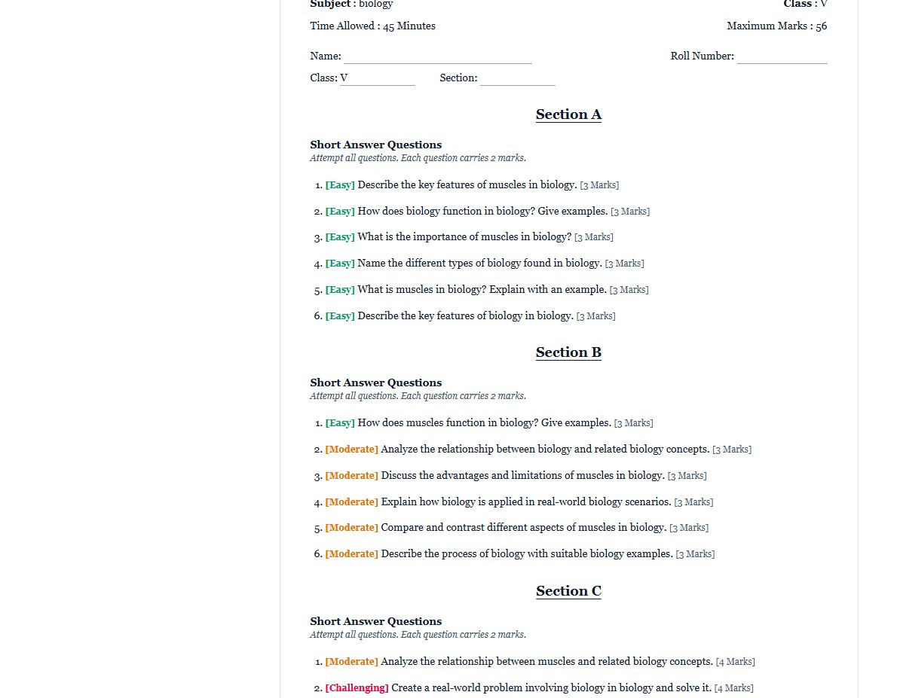
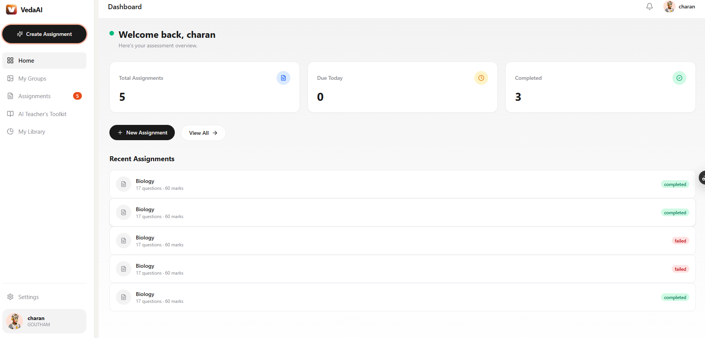

# VedaAI — AI-Powered Assessment Creator

Create question papers for your classes in seconds using AI. Built for teachers, by teachers.

## 🚀 Live App

**Frontend:** https://veda-ai-kappa-one.vercel.app  
**Backend API:** https://vedaai-backend-wxe5.onrender.com

No installation needed — just open the link and register.

---

## 📖 What is VedaAI?

VedaAI is a web application that helps teachers generate custom question papers using AI. You pick the subject, class, question types, and due date — VedaAI creates a complete, printable question paper with an answer key.

**You don't need to be technical to use it.** If you can use a website like Gmail or Google Drive, you can use VedaAI.

---

## 📸 Screenshots

| Dashboard & Stats | Create Assignment |
|:---:|:---:|
|  |  |

| Question Paper Output | Settings & AI Mode |
|:---:|:---:|
|  |  |

---

## ✨ Features

| Feature | Description |
|---------|-------------|
| **Dashboard** | Overview of your stats — total assignments, due today, completed |
| **Create Assignment** | Pick subject, class, upload reference files, choose question types, set due date |
| **AI Generation** | Questions generated by AI (Groq or OpenAI) — or offline mock mode for testing |
| **Question Paper** | Beautifully formatted output with difficulty badges, answer key, and PDF download |
| **Groups** | Create class groups and manage student rosters |
| **Library** | Browse all your completed question papers |
| **AI Toolkit** | Question Paper Generator (live) + Lesson Plan Creator & Performance Analytics (coming soon) |
| **Notifications** | Bell icon shows assignment completed/failed/due alerts |
| **Settings** | Profile, API Key, Password, and AI Mode configuration |

---

## 🧭 Pages Guide

### Login / Register
- Go to the app URL → click **Register**
- Enter: Teacher ID, Name, Email, Password, School, Class, Subject
- Login with your Teacher ID and Password

### Dashboard
Shows your stats (total assignments, due today, completed) and your 5 most recent assignments.

### Create Assignment
1. Give it a **title**
2. Select **subject** and **class**
3. Set a **due date**
4. Choose **question types** (Short Answer, Long Answer, MCQ, Fill in the Blanks, True/False, Match the Following) — add as many as you want
5. Optionally upload a **reference file** (.pdf, .txt, .md, .doc, .docx, .jpg, .png — max 10 MB)
6. Click **Generate**

Watch the progress bar — when it's done, you'll see your question paper. You can regenerate if you don't like the result.

### Groups
Create groups (e.g., "Class 5A") and add students with name, roll number, and email. Useful for class management.

### Library
All your completed question papers in one place. Search by title.

### Settings — 4 Tabs

#### 1️⃣ Profile
Edit your name, subject, school, location, and class.

#### 2️⃣ API Key
Paste your API key here. Supports:
- **Groq** (free — 60 requests/min): Get a key at https://console.groq.com
- **OpenAI**: Get a key at https://platform.openai.com/api-keys
- **Any OpenAI-compatible provider**

Your key is stored securely in your browser and sent with each generation request.

#### 3️⃣ Password
Change your account password.

#### 4️⃣ AI Mode
- **Mock Mode (Testing)**: Turn this ON to generate questions locally without any API key. Questions are simpler but the app works fully offline. Great for trying things out.
- **Live Mode**: Turn this OFF to use your API key for real AI-generated questions.

**LLM Provider Config** (below the toggle):
- **Base URL**: Leave blank for OpenAI. For Groq, enter: `https://api.groq.com/openai/v1`
- **Model**: `gpt-4o-mini` (OpenAI) or `llama3-70b-8192` (Groq)

---

## 🔧 How to Run Locally (For Development)

### Prerequisites
- Node.js 18+
- MongoDB (local or Atlas)
- Redis (local or Upstash) — optional, for queue

### Backend Setup

```bash
cd backend
npm install

# Copy .env.example to .env and fill in:
cp .env.example .env
# Edit .env with your MONGO_URI, JWT_SECRET, etc.

npm run dev
```

### Frontend Setup

```bash
cd frontend
npm install
npx next dev
```

Open http://localhost:3000

---

## 🐳 Deployed Architecture

| Component | Hosting | URL |
|-----------|---------|-----|
| Frontend | Vercel (free) | https://veda-ai-kappa-one.vercel.app |
| Backend | Render Web Service (free) | https://vedaai-backend-wxe5.onrender.com |
| Database | MongoDB Atlas (free M0) | — |
| Cache | Upstash Redis (free) | — |

The frontend automatically connects to the backend. No configuration needed.

---

## 📱 Mobile

VedaAI works on both desktop and mobile. On phones, the sidebar turns into a hamburger menu, and a bottom navigation bar appears for easy one-handed use.

---

## ❓ FAQ

**Q: Do I need an API key to use the app?**  
A: No — turn on Mock Mode in Settings to generate questions locally. For real AI questions, get a free Groq key at https://console.groq.com.

**Q: I have an OpenAI key. Can I use it?**  
A: Yes. In Settings → AI Mode, leave Base URL blank and set Model to `gpt-4o-mini` (or any model you have access to). Save your key in Settings → API Key.

**Q: Can I use Groq for free?**  
A: Yes. Groq offers a free tier (60 requests/min, 9000 tokens/min). Set Base URL to `https://api.groq.com/openai/v1` and Model to `llama3-70b-8192`.

**Q: Are my API keys safe?**  
A: Your key is stored in your browser's localStorage and sent with each generation request. It is never exposed to other users.

**Q: How do I download a question paper as PDF?**  
A: Open any completed assignment → click the Download PDF button at the top.

**Q: Why did my generation fail?**  
A: Check you have an API key saved (if live mode) or Mock Mode is ON. Also check your subject and question types are filled in.

---

## 📝 License

Private — for educational use.
